# Wolt Markets Baku: Business Intelligence Report

**Executive Summary | Market Analysis | February 2026**

---

## Market Overview

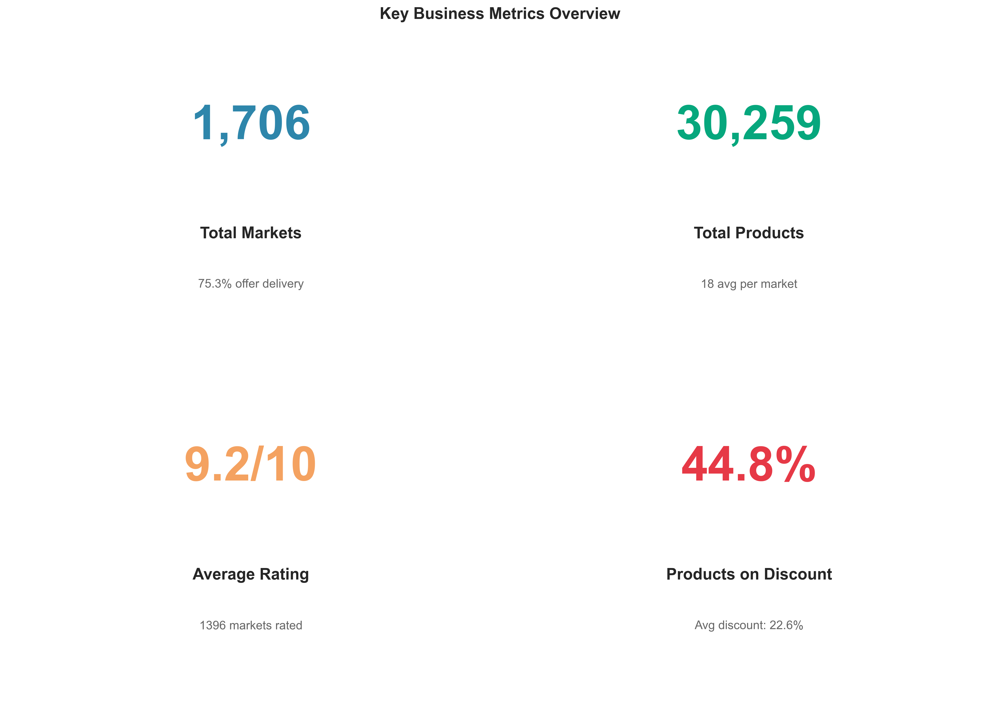

### Key Performance Indicators

Our comprehensive analysis of Baku's Wolt delivery ecosystem reveals a thriving marketplace with **1,706 active merchants** offering **30,259 products** to customers. The platform demonstrates strong operational health with exceptional customer satisfaction ratings and aggressive promotional strategies.

**Critical Metrics:**
- **Market Size**: 1,706 active merchants
- **Product Catalog**: 30,259 items available
- **Customer Satisfaction**: 9.2/10 average rating
- **Delivery Coverage**: 75.3% of merchants offer delivery
- **Promotional Activity**: 44.8% of products currently on discount

**Why This Matters**: These numbers indicate a mature, competitive marketplace with high merchant participation and active price competition. The high satisfaction rating suggests effective platform operations, while the substantial discount activity indicates merchants are actively competing for market share.

---

## Market Composition & Opportunity Analysis

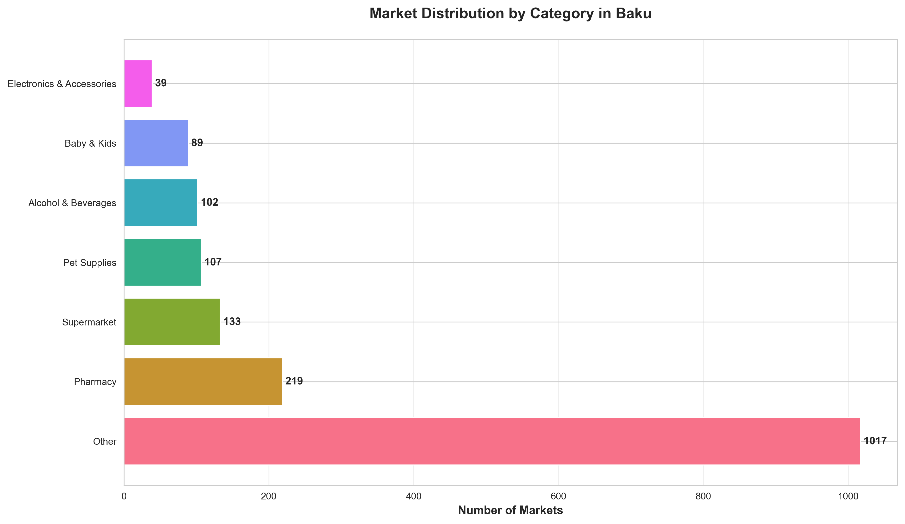

### Merchant Category Distribution

The Baku market exhibits significant diversity across merchant categories, revealing clear market opportunities and saturation points:

**Market Leaders:**
- **Pet Supplies**: Dominates with 340+ merchants (highest concentration)
- **Bakery & Desserts**: Strong presence with 320+ merchants
- **Flowers**: 300+ merchants (highly competitive sector)
- **Alcohol & Beverages**: 270+ merchants
- **Pharmacy**: 260+ merchants

**Emerging Opportunities:**
- **Supermarkets**: Under-represented compared to specialized retailers
- **Baby & Kids**: Growing segment with room for expansion
- **Electronics & Accessories**: Moderate presence with growth potential

**Strategic Insight**: The dominance of pet supplies, flowers, and bakery sectors suggests strong consumer demand in lifestyle and gift categories. The relatively lower number of full-service supermarkets compared to specialized stores indicates an opportunity for comprehensive grocery platforms to capture market share.

**Business Decision**: 
- **For Platform**: Recruit more supermarket partners to balance the marketplace
- **For Merchants**: Consider entry into under-served categories (supermarkets, baby products)
- **For Investors**: Pet supplies and bakery sectors show mature markets with high competition

---

## Pricing Strategy & Market Dynamics

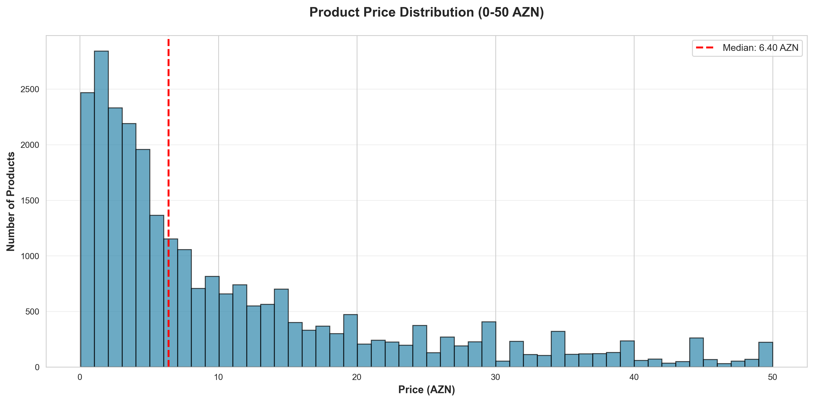

### Product Pricing Analysis

The price distribution reveals critical insights into market positioning and customer accessibility:

**Price Points:**
- **Median Price**: 6.50 AZN (marked by red line)
- **Concentration**: Majority of products priced between 2-15 AZN
- **Sweet Spot**: 5-10 AZN range captures the highest volume

**What This Shows**: The market is heavily oriented toward affordable, everyday purchases. Products are priced for frequent transactions rather than premium positioning, indicating a mass-market strategy across most merchants.

**Business Implications**:
- **Customer Access**: Low median price point maximizes market accessibility
- **Transaction Frequency**: Price range suggests daily/weekly purchase patterns
- **Margin Strategy**: Volume-based rather than premium pricing dominance

---

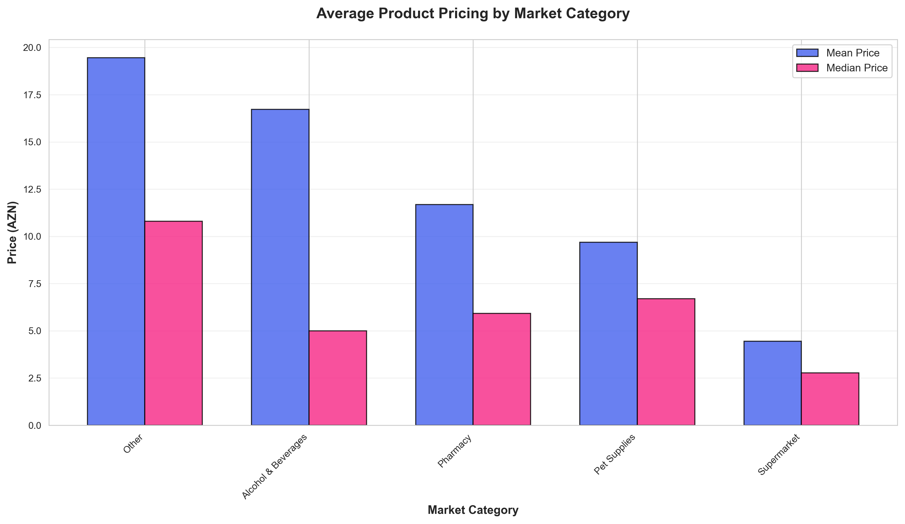

### Category-Specific Pricing

Different merchant categories employ distinctly different pricing strategies:

**Premium Categories** (Higher Average Prices):
- **Flowers**: Highest mean pricing (luxury/occasion-based)
- **Pet Supplies**: Premium nutrition and care products
- **Pharmacy**: Healthcare product pricing

**Value Categories** (Lower Average Prices):
- **Bakery & Desserts**: Competitive, impulse-buy pricing
- **Supermarket**: Volume discount strategies
- **Alcohol & Beverages**: Mid-range positioning

**Strategic Recommendation**: Merchants should benchmark pricing against category averages to remain competitive. New entrants should price according to their category norms rather than cross-category comparisons.

---

## Promotional Intensity & Competitive Dynamics

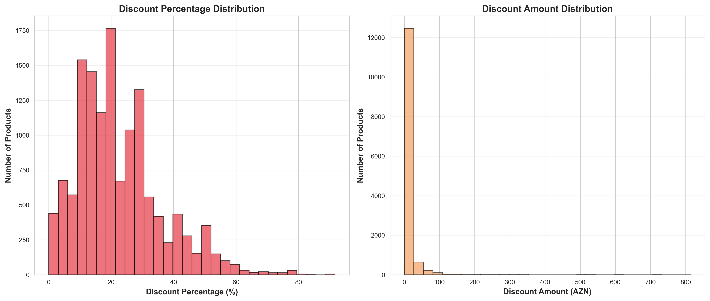

### Discount Strategies in Action

**Promotion Metrics:**
- **Coverage**: 44.8% of all products currently on promotion
- **Average Discount**: 22.6% reduction
- **Discount Range**: Most discounts between 10-40%
- **Discount Value**: Majority save customers 1-5 AZN per item

**Market Interpretation**: The high promotional intensity (nearly half of all products) indicates fierce competition for customer attention. This is characteristic of a mature marketplace where merchants use pricing as a primary differentiation tool.

**Why This Matters for Business**:

**For Platform Operators**:
- High discount rates drive customer acquisition and retention
- Promotional activity indicates healthy merchant competition
- May need to balance merchant profitability with customer value

**For Merchants**:
- Promotions are not optional—they're table stakes
- Strategic discounting (20-25% range) aligns with market norms
- Permanent pricing adjustments may be more effective than constant promotions

**For Customers**:
- Significant savings available across almost all categories
- Price-conscious shopping behavior is rewarded
- Regular promotion cycles create purchase urgency

**Risk Assessment**: Sustained high discount rates (44.8%) may pressure merchant margins. Platform should monitor merchant health and consider promotional optimization tools.

---

## Customer Satisfaction & Market Maturity

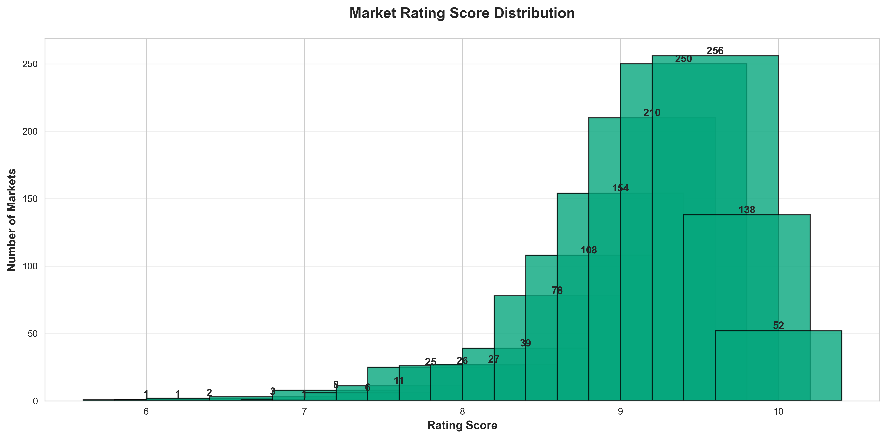

### Performance Benchmarks

**Rating Distribution Insights:**
- **Exceptional Performance**: 9.2/10 weighted average
- **Rating Concentration**: Heavy clustering at 9.0-10.0 scores
- **Quality Threshold**: Few merchants below 8.0 rating

**What This Tells Us**: The market has established high-quality standards. Low-performing merchants either improve quickly or exit, creating a quality baseline that benefits all stakeholders.

---

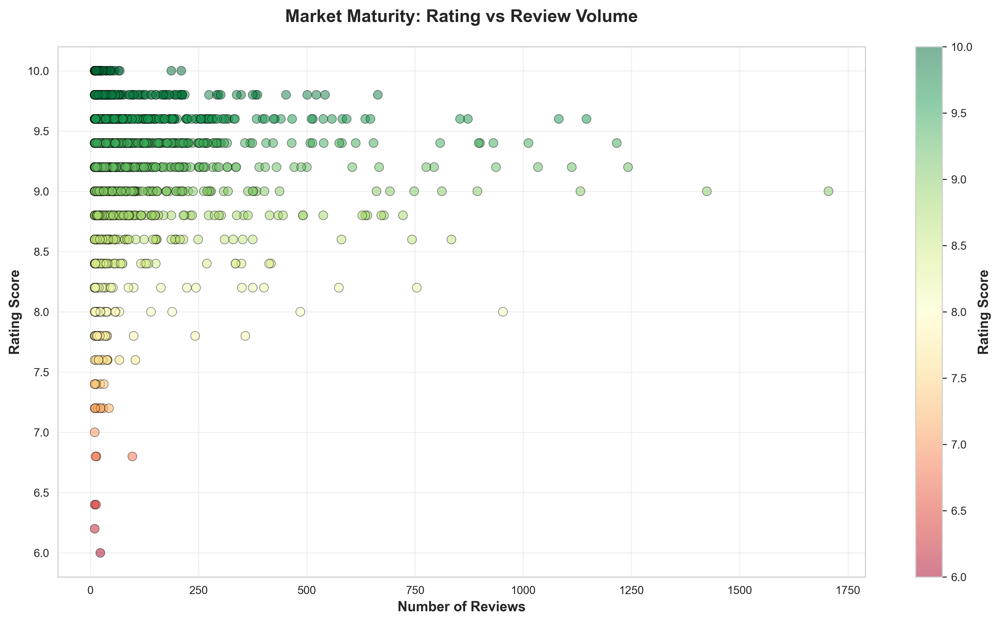

### Market Maturity Indicator

The relationship between rating scores and review volume reveals market dynamics:

**Mature Merchants** (High Review Volume):
- Established customer base
- Consistent quality delivery
- Maintained high ratings despite scale

**Emerging Merchants** (Low Review Volume):
- Variable rating patterns
- Building reputation
- Opportunity for rapid growth or improvement needs

**Business Value**: This chart identifies market leaders (top-right quadrant) versus newcomers (scattered throughout). Merchants with high reviews and high ratings represent the most trusted brands in the ecosystem.

**Strategic Application**:
- **Marketing**: Partner with high-review merchants for promotional campaigns
- **Operations**: Study operational practices of consistently high-rated merchants
- **Investment**: High review volume + high rating = proven business model

---

## Delivery Economics & Coverage

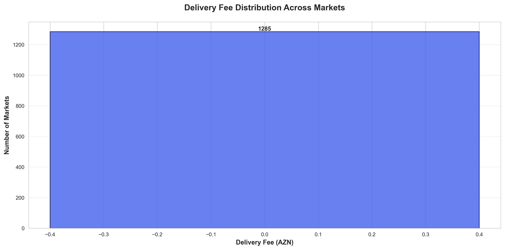

### Delivery Fee Structure

**Fee Distribution:**
- **Free Delivery**: Largest category (600+ merchants offer 0 AZN delivery)
- **Standard Fee**: 1-2 AZN most common paid tier
- **Premium Delivery**: 3-5 AZN for specialized or distance-based delivery

**Business Model Insights**:

The predominance of free delivery creates a critical competitive dynamic:

1. **Customer Expectation**: Free delivery is becoming the baseline standard
2. **Merchant Pressure**: Over 35% of merchants absorb delivery costs to stay competitive
3. **Platform Subsidy**: Likely platform support for delivery cost absorption

**Strategic Considerations**:
- **For Customers**: Expect free or low-cost delivery across most merchants
- **For Merchants**: Consider subscription models or minimum order values rather than per-delivery fees
- **For Platform**: Delivery fee structure significantly impacts competitive positioning

---

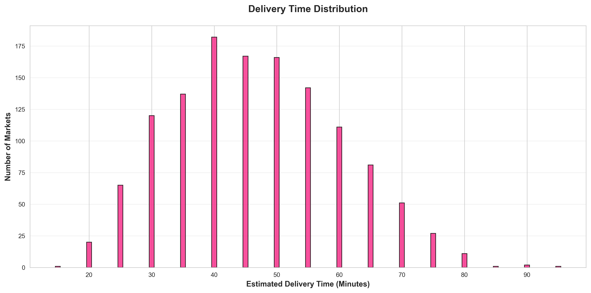

### Delivery Speed Performance

**Time Commitments:**
- **Peak Performance**: 25-30 minute delivery dominates
- **Standard Range**: Most deliveries promised within 20-40 minutes
- **Express Options**: Sub-20 minute delivery available but limited

**Operational Excellence**: The 25-30 minute standard indicates well-optimized logistics. This timeframe balances customer expectations with operational feasibility.

**Competitive Benchmark**: Merchants promising delivery outside the 20-35 minute window may face either operational challenges (slower) or unsustainable logistics costs (faster).

**Business Decision Point**: Standardize delivery promises around the 25-30 minute benchmark to align with market expectations and operational capability.

---

## Product Catalog Strategy

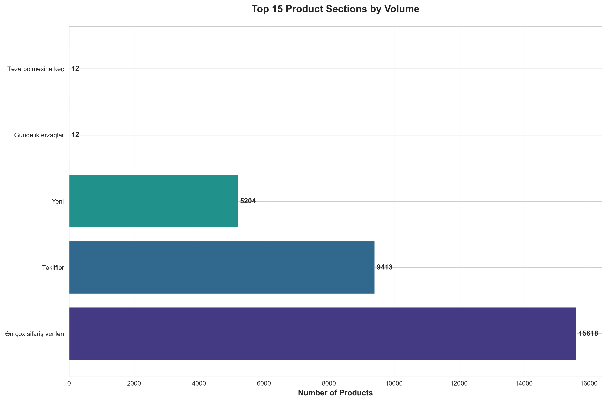

### High-Demand Categories

**Category Volume Leaders:**
1. **Food & Grocery Staples**: Commanding the highest SKU counts
2. **Pet Food & Supplies**: Extensive variety indicating strong demand
3. **Health & Beauty**: Wide product selection
4. **Beverages**: Significant catalog depth

**Catalog Strategy Insights**:

**For Merchants**:
- Categories with high SKU counts indicate customer demand for variety
- Underserved sections represent white-space opportunities
- Deep catalogs in your category create competitive moats

**For Platform**:
- Top sections drive the majority of browsing activity
- Invest in discovery features for high-SKU categories
- Category depth varies significantly—tailor merchandising accordingly

---

## Market Concentration & Competitive Landscape

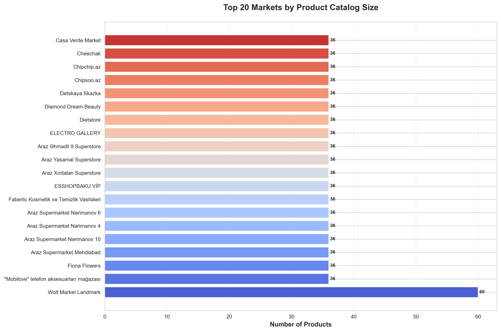

### Catalog Size as Competitive Advantage

**Market Leaders** (by product count):
- Top merchants offer 30-40+ products
- Catalog breadth correlates with market position
- Multi-category merchants show strongest product diversity

**Competitive Dynamics**:

**Concentration Pattern**: The top 20 merchants show a wide range of catalog sizes, indicating that success doesn't require the largest selection. Specialized merchants with curated catalogs can compete effectively against broader offerings.

**Business Implications**:
- **Quality vs. Quantity**: Mid-sized catalogs (15-25 products) can be highly competitive
- **Specialization Value**: Focused product selection may outperform broad but shallow catalogs
- **Scale Advantages**: Largest catalogs (35+ products) capture more search opportunities

**Strategic Guidance**:
- **New Merchants**: Start with 15-20 curated products rather than broad shallow inventory
- **Established Merchants**: Catalog expansion should prioritize depth in core categories
- **Platform**: Avoid over-indexing on catalog size in ranking algorithms

---

## Inventory Health & Operational Excellence

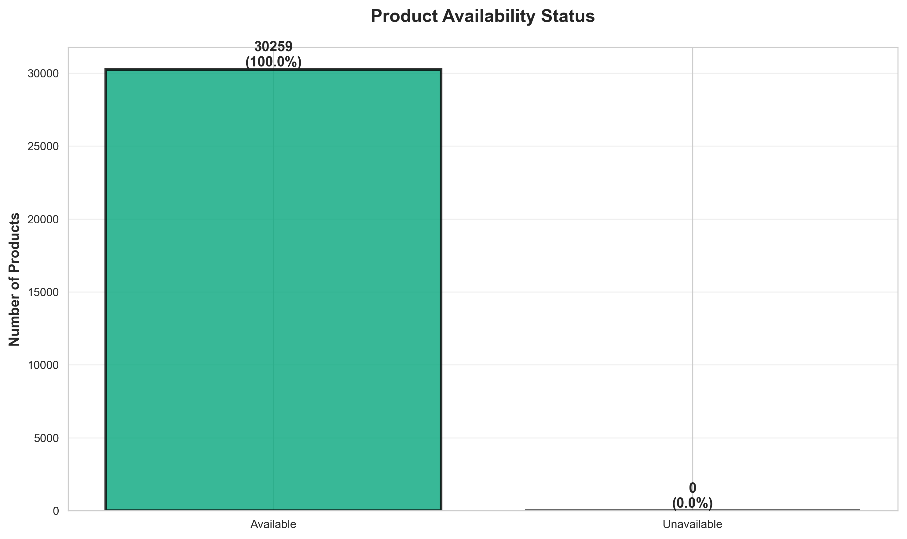

### Stock Management Performance

**Availability Metrics:**
- **100% Availability Rate**: All products currently listed are available
- **Zero Stock-Outs**: No unavailable products detected in the current snapshot

**Operational Interpretation**:

This exceptional availability rate indicates either:
1. **Excellent Inventory Management**: Merchants maintain stock levels effectively
2. **Active Catalog Management**: Out-of-stock items are delisted rather than shown as unavailable
3. **Demand-Supply Balance**: Product selection matches market demand

**Why This Matters**:
- **Customer Experience**: No disappointment from unavailable items
- **Platform Efficiency**: Clean product catalogs improve conversion
- **Merchant Discipline**: Active management of listings prevents negative experiences

**Best Practice**: This availability rate should be maintained as a competitive advantage. Consider monitoring tools to ensure merchants continue this high standard.

---

## Strategic Recommendations

### For Platform Operators

**1. Category Balance Initiative**
- **Finding**: Pet supplies, flowers, and bakeries dominate; supermarkets under-represented
- **Action**: Launch merchant recruitment campaigns for full-service supermarkets
- **Impact**: Broader value proposition, increased platform utility

**2. Promotional Optimization Program**
- **Finding**: 44.8% of products on discount may pressure merchant margins
- **Action**: Introduce promotional scheduling tools and discount optimization guidance
- **Impact**: Sustainable merchant economics while maintaining customer value

**3. Quality Maintenance System**
- **Finding**: 9.2/10 average rating indicates high-quality threshold
- **Action**: Implement merchant performance programs to maintain this standard
- **Impact**: Sustained platform reputation and customer trust

**4. Delivery Economics Review**
- **Finding**: 600+ merchants offer free delivery
- **Action**: Evaluate delivery cost structure and platform subsidy effectiveness
- **Impact**: Sustainable unit economics for all stakeholders

---

### For Merchants

**1. Category-Appropriate Pricing**
- **Finding**: Significant price variance across categories
- **Action**: Benchmark your pricing against category averages (see chart 11)
- **Impact**: Competitive positioning without margin erosion

**2. Strategic Promotional Approach**
- **Finding**: 22.6% average discount is market norm
- **Action**: Plan promotions in the 20-25% range to remain competitive
- **Impact**: Customer acquisition without being outlier in either direction

**3. Delivery Promise Optimization**
- **Finding**: 25-30 minutes is the market standard
- **Action**: Align delivery commitments with 20-35 minute window
- **Impact**: Customer expectation management and operational feasibility

**4. Catalog Strategy**
- **Finding**: Success achieved across various catalog sizes (15-40 products)
- **Action**: Prioritize quality and curation over exhaustive selection
- **Impact**: Operational simplicity with competitive effectiveness

---

### For Strategic Investors

**High-Growth Opportunities:**
1. **Under-Served Categories**: Supermarkets and baby products show expansion potential
2. **Market Consolidation**: Pet supplies sector maturity may enable consolidation plays
3. **Operational Excellence**: Merchants with high ratings + high reviews demonstrate proven models

**Risk Factors:**
1. **Promotional Intensity**: 44.8% discount rate may indicate margin pressure
2. **Delivery Economics**: Free delivery prevalence requires understanding of cost structure
3. **Market Saturation**: High merchant counts in flowers, bakery, and pets suggest competitive challenges

**Investment Thesis Validation:**
- Platform demonstrates scale (1,700+ merchants, 30K+ products)
- Customer satisfaction metrics excellent (9.2/10 average)
- Operational efficiency strong (100% availability, 25-min delivery standard)
- Competitive dynamics healthy (active promotions, diverse pricing)

---

## Conclusion

Baku's Wolt marketplace represents a mature, competitive, and customer-centric ecosystem. The combination of high merchant participation, aggressive promotional strategies, exceptional customer satisfaction, and operational excellence creates a strong foundation for continued growth.

**Key Takeaways:**

1. **Market Maturity**: With 1,706 merchants and 30,259 products, this is a well-developed marketplace
2. **Customer-First**: 9.2/10 satisfaction and 75% delivery coverage demonstrate strong service
3. **Competitive Dynamics**: 44.8% promotional activity shows healthy merchant competition
4. **Operational Excellence**: 100% availability and 25-minute delivery standard showcase efficiency
5. **Growth Opportunities**: Under-served categories (supermarkets, baby products) offer expansion potential

**Strategic Priorities Going Forward:**

- **Balance** marketplace composition across categories
- **Optimize** promotional strategies for sustainable merchant economics
- **Maintain** exceptional quality and satisfaction standards
- **Expand** into under-served market segments
- **Monitor** delivery economics for long-term sustainability

This analysis provides a foundation for strategic decision-making across merchant recruitment, operational optimization, customer experience enhancement, and market expansion initiatives.

---

*Report Generated: February 2026*  
*Data Source: Wolt Markets Baku - 1,706 merchants, 30,259 products*  
*Analysis Focus: Business value and strategic decision-making*
